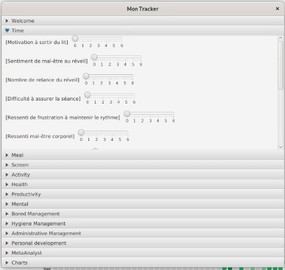
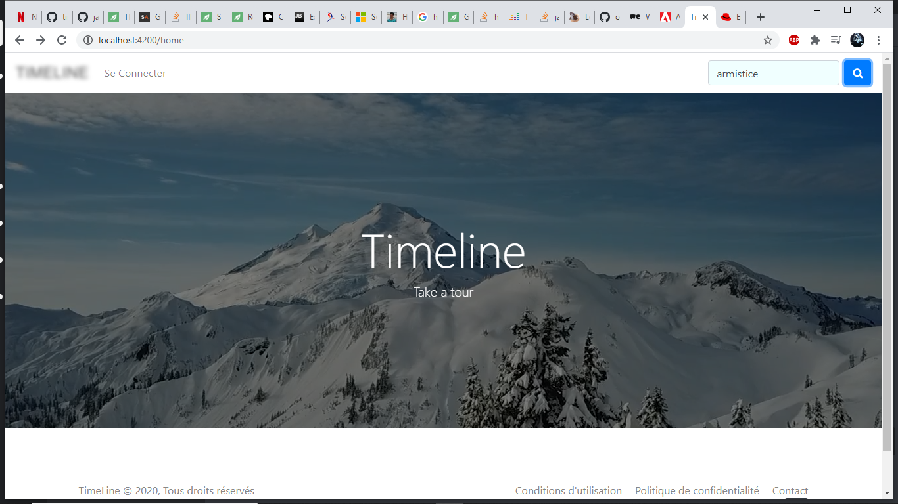

# Bienvenue sur mon GitHub 👋

<!--
**Charlene19/Charlene19** is a ✨ _special_ ✨ repository because its `README.md` (this file) appears on your GitHub profile.

Here are some ideas to get you started:

- 🔭 I’m currently working on ...
- 🌱 I’m currently learning ...
- 👯 I’m looking to collaborate on ...
- 🤔 I’m looking for help with ...
- 💬 Ask me about ...
- 📫 How to reach me: ...
- 😄 Pronouns: ...
- ⚡ Fun fact: ...
-->

## Sur ce ReadMe, je fais une description brève des projets sur cet espace github. 

          
          
        

  
<h2 style="display: inline-block">Table of Contents</h2>

  <ol>
    <li> <a href="#tracker-type-loglife-">Tracker</a> </li>
 <li> <a href="#reactjs-site-web-type-portfolio-">ReactJs - Site web type Portfolio</a> </li>
 <li><a href="#projet-n-tiers-back-javafx-restapi-">Projet N-Tiers Back (JavaFX, RestApi)</a></li> 
    <li> <a href="#bookshop-web-">BookShop Web</a></li>
    <li><a href="#application-back-end-support-du-bookshop-web-">Application Back-end support du BookShop Web</a></li>
    <li><a href="#timeline-angular">Timeline Angular</a></li>
    <li><a href="#Anki Track">Anki Track</a></li>
    <li><a href="#secondbrain-">Second Brain</a></li>
     <li><a href="#pomodoro-compteur-">Pomodoro</a></li>
    <li><a href="#contact">Contact</a></li>
  </ol>

## Tracker Type LogLife :

## ReactJs, Site web type Portfolio : 

Un site type portfolio pour une photographe. Le projet est [consultable](https://github.com/Charlene19/sarahProject/edit/master/README.md). Il est aussi déployé : [Sarah Trioullier](https://www.sarahtrioullier.com)

## Projet N-Tiers Back (JavaFX, RestApi) : 

Application de back-end d'une librairie en ligne. Persistance de données avec JPA sur une base de données SQL Server. Et une interface graphique avec Java FX.

Le projet est [consultable](https://github.com/Charlene19/BookShop). 

## Timeline Angular

Site web type réseau social. Monté en Angular. 

Le projet est [consultable](https://github.com/cda2006-314/timeline/tree/master). 

## BookShop Web : 

L'application web d'une librairie en ligne.

Le projet est [consultable](https://github.com/Charlene19/BookShopWeb). 

## Application Back-end support du BookShop Web : 

Application de back-end d'une librairie en ligne. Persistance de données avec JPA sur une base de données SQL Server. Et une interface graphique avec Java FX.

Le projet est [consultable](https://github.com/Charlene19/BookShop). 
## SecondBrain : 

Un recueil de notes.

Le projet est en [ligne](https://charlene19.github.io/secondBrain/). 

## Anki Track : 

Anki style permis progression
Un petit tracker de progression d'apprentissage. Celui-ci est fourni avec des questions autour du permis de conduire mais les questions peuvent être modifiées pour fitter avec les besoins.

Le projet est [consultable](https://github.com/Charlene19/BookShop). 

## Pomodoro Compteur : 

## Contact

[Via mon site web](https://charlene19.github.io/). 

