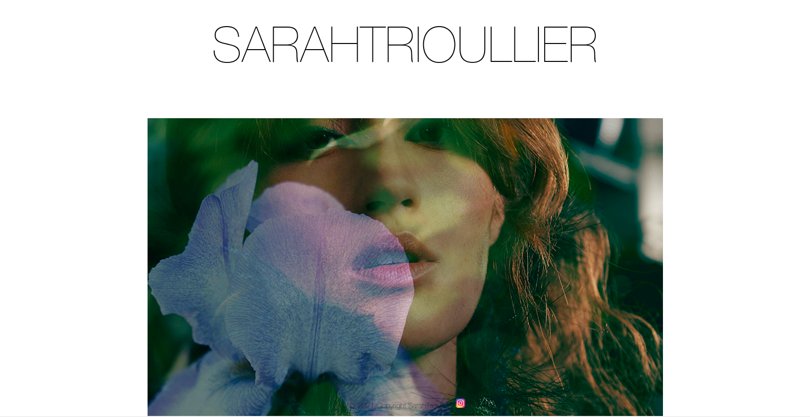
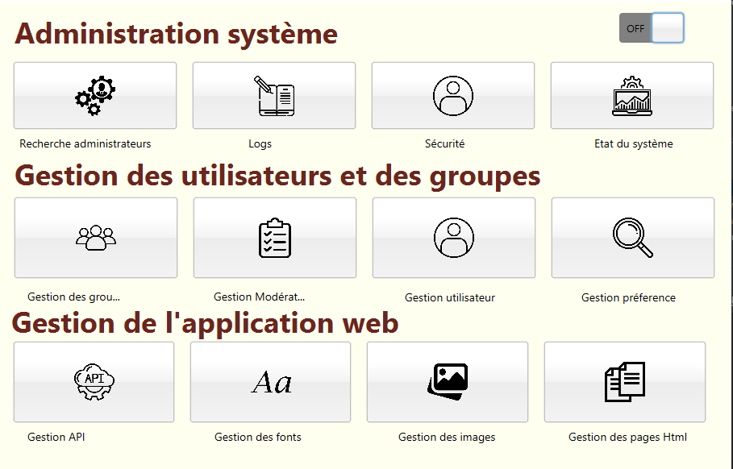

# Bienvenue sur mon GitHub 👋

<!--
**Charlene19/Charlene19** is a ✨ _special_ ✨ repository because its `README.md` (this file) appears on your GitHub profile.

Here are some ideas to get you started:

- 🔭 I’m currently working on ...
- 🌱 I’m currently learning ...
- 👯 I’m looking to collaborate on ...
- 🤔 I’m looking for help with ...
- 💬 Ask me about ...
- 📫 How to reach me: ...
- 😄 Pronouns: ...
- ⚡ Fun fact: ...
-->

Sur ce ReadMe, je fais une description brève des projets sur cet espace github. 

  
<h2 style="display: inline-block">Table of Contents</h2>

  <ol>
    <li>
      <a href="#ReactJs, Site web type Portfolio">ReactJs</a>
      <ul>
        <li><a href="#Projet N-Tiers Back (JavaFX, RestApi)">Projet N-Tiers Back (JavaFX, RestApi)</a></li>
      </ul>
    </li>
    <li>
      <a href="#BookShop Web">BookShop Web</a>
      <ul>
        <li><a href="#Application Back-end support du BookShop Web">Application Back-end support du BookShop Web</a></li>
        <li><a href="#Pomodoro Compteur">Pomodoro Compteur</a></li>
      </ul>
    </li>
    <li><a href="#Timeline Angular">Timeline Angular</a></li>
    <li><a href="#roadmap">Roadmap</a></li>
    <li><a href="#contributing">Contribuer</a></li>
    <li><a href="#license">License</a></li>
    <li><a href="#contact">Contact</a></li>
    <li><a href="#acknowledgements">À savoir</a></li>
  </ol>

## Tracker Type LogLife :

## ReactJs, Site web type Portfolio : 

## Projet N-Tiers Back (JavaFX, RestApi) : 

## Timeline Angular

## BookShop Web : 

## Application Back-end support du BookShop Web : 

## Pomodoro Compteur : 

