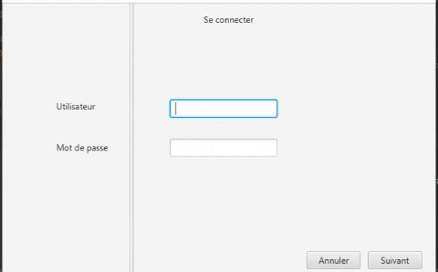

### Hi there 👋

<!--
**Charlene19/Charlene19** is a ✨ _special_ ✨ repository because its `README.md` (this file) appears on your GitHub profile.

Here are some ideas to get you started:

- 🔭 I’m currently working on ...
- 🌱 I’m currently learning ...
- 👯 I’m looking to collaborate on ...
- 🤔 I’m looking for help with ...
- 💬 Ask me about ...
- 📫 How to reach me: ...
- 😄 Pronouns: ...
- ⚡ Fun fact: ...
-->
Description brève des projets sur ce github. 

ReactJs, Site web type Portfolio : 

Projet N-Tiers Back (JavaFX, RestApi) : 

BookShop Web : 

Application Back-end support du BookShop Web : 

Petit programme inspiré du tuto Les Teachers du Net (Java FX) : 

